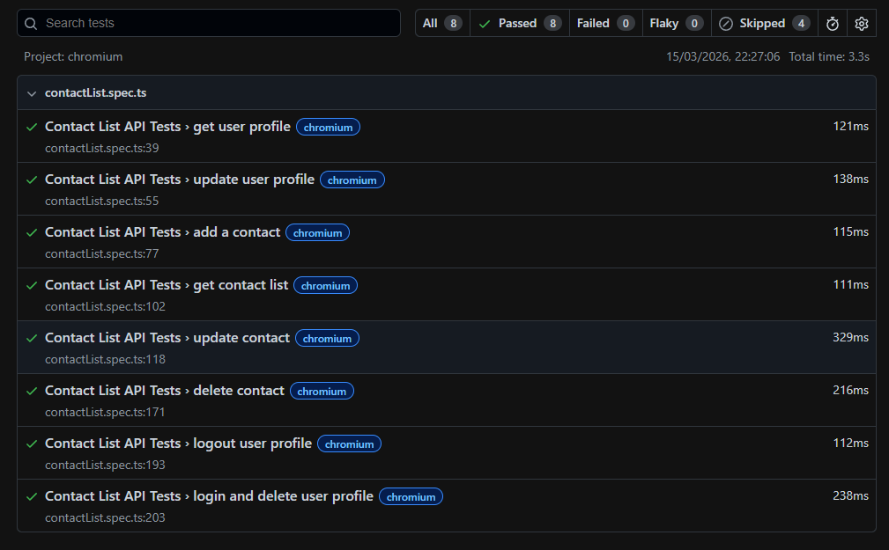
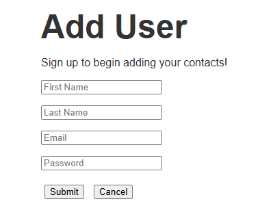
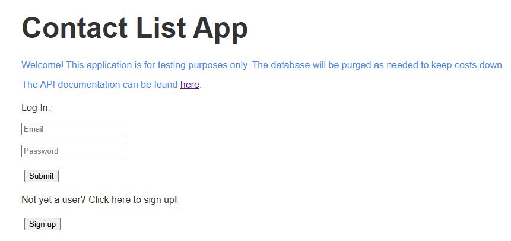
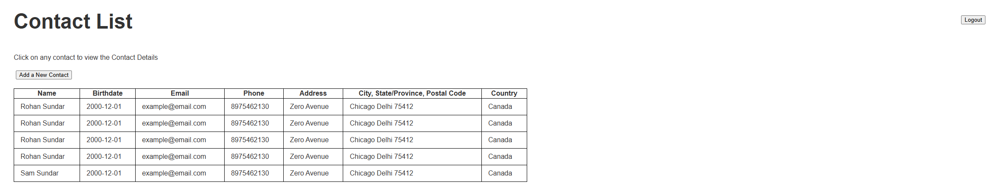
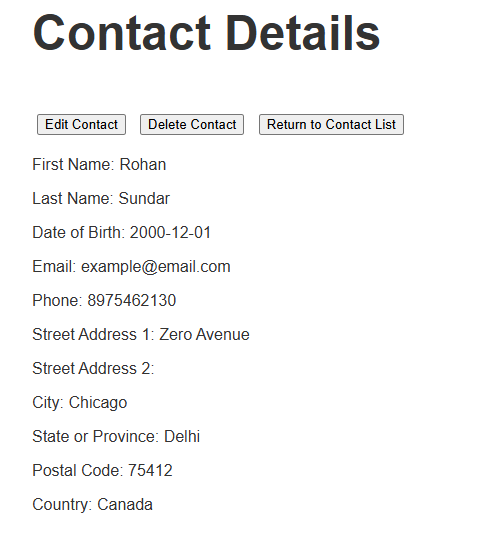
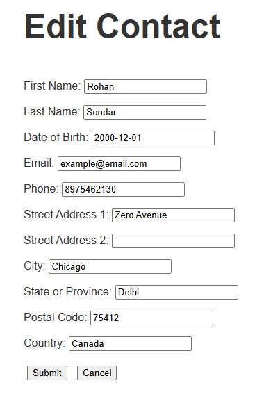

# Playwright API Testing Project - Thinking Tester Contact List

This project uses Playwright Test to validate core API workflows for the Thinking Tester Contact List application.

- App URL: https://thinking-tester-contact-list.herokuapp.com/
- API Documentation: https://documenter.getpostman.com/view/4012288/TzK2bEa8

<b>Note: No UI Interactions have been made in this project.</b>

## Overview

The suite automates an end-to-end API lifecycle for a user and their contacts:

1. Create a new user with random credentials.
2. Capture and reuse the authentication token.
3. Read and update the user profile.
4. Create, read, update, and delete contacts. (CRUD Operations)
5. Logout, login again, and use the refreshed token.
6. Delete the test user profile for cleanup.

The tests are written in TypeScript and run with Playwright Test.

## Tech Stack

- Node.js
- TypeScript
- Playwright Test

## Project Structure

```text
.
|- playwright.config.ts
|- package.json
|- tests/
|  |- contactList.spec.ts
|  |- api.spec.ts
|- utils/
|  |- helperFunctions.ts
```

## Test Data Strategy

The project uses utility functions in utils/helperFunctions.ts to avoid collisions during repeated executions:

- generateRandomEmail: creates a unique test email for each run.
- generateRandomPassword: creates a password with mixed character types.

This helps ensure user creation remains reliable across multiple runs.

## API Test Flow

Main workflow is in tests/contactList.spec.ts.

### 1) Setup (beforeAll)

- A new API request context is created.
- To generate a token, you can simply open an account in the app. In Network Tab, go to contacts Header.
- A user is created through POST /users.
- The response token is captured and stored for subsequent requests.

### 2) User Profile Validation

- GET /users/me validates the created user profile.
- PATCH /users/me updates and verifies profile fields.

### 3) Contact Lifecycle

- POST /contacts adds a new contact.
- GET /contacts verifies list retrieval.
- PUT /contacts/:id performs a full contact update.
- PATCH /contacts/:id performs a partial update.
- DELETE /contacts/:id removes the updated contact.

### 4) Auth Lifecycle

- POST /users/logout invalidates the existing token.
- POST /users/login authenticates again and returns a fresh token.
- DELETE /users/me removes the created user using the refreshed token.

## Status Codes Validated

The suite validates key HTTP statuses:

- 201 for resource creation (user, contact).
- 200 for retrieval, updates, logout/login, and deletes.

## Test Execution Model

- Global configuration has fullyParallel enabled.
- The contact suite uses test.describe.configure({ mode: 'serial' }) to preserve stateful flow.
- This ensures token and entity dependencies are handled in sequence.

## Setup Instructions

## 1. Install dependencies

```bash
npm install
```

## 2. Install Playwright browsers

```bash
npx playwright install
```

## 3. Run all tests

```bash
npx playwright test
```


## Reports

The project uses the HTML reporter.

After execution, open the report with:

```bash
npx playwright show-report
```

## Notes and Best Practices

- Keep dependent API scenarios in serial mode when sharing token/state.
- Always parse response JSON before asserting response body fields.
- Assert status from the response object, not from parsed JSON.
- For contact update/delete, fetch the contact list and select the target contact id before calling PUT, PATCH, or DELETE.

## Future Improvements

- Move hardcoded token usage fully out of setup requests where not required.
- Externalize environment-specific values into environment variables.
- Add negative test cases for validation and auth errors.
- Add API contract checks for response schemas.

## Test Results



## Reference Screenshots of the Application

Sign Up Page:

Log in Page:

Contact List Page:

Contact Details Page:

Edit Contact Page:

